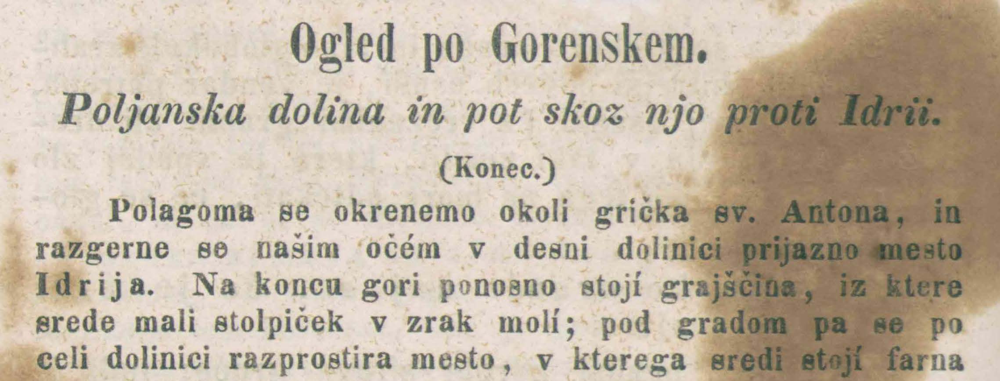
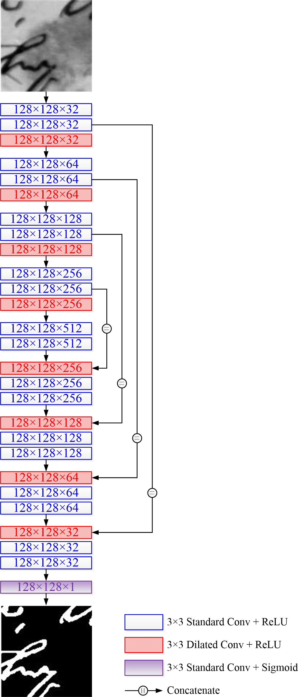

# FD-Net: A Fully Dilated Convolutional Network for Historical Document Image Binarization

**This paper has been accepted and will be published in Proceedings of the *4th Chinese Conference on Pattern Recognition and Computer Vision (PRCV 2021)*, so please stay tuned.**

## Introduction

Binarization of antiquarian document images is one of the most important operations in the digitization process, which helps to resolve the conflict between document conservation and cultural heritage.

Historical document images suffer from severe degradation, such as torn page, ink bleed through, text stroke fading, page stain, and artifacts. In addition, the variation of text strokes in degraded handwritten manuscripts further increases the difficulty of binarization.

Figure 1: Historical document image samples from recent DIBCO and H-DIBCO benchmark datasets

## Motivation

The SOTA models for document image binarization are variants of the encoder-and-decoder architecture, such as FCN and U-Net. These segmentation models have three key components in common:

- **The encoder** comprises consecutive of convolutions and downsampling (e.g., max-pooling) to extract higher-level features, but reduces the spatial resolution of intermediate feature maps, which may lead to internal data structure missing or spatial hierarchical information loss;
- **The decoder** consists of repeated upsampling (e.g., bilinear interpolation) and convolutions to restore feature maps to the desired spatial resolution, which may also result in pixelation or texture smoothing;
- **Skip connections** merge feature maps with the same levels and transfer localization information from the encoder to the decoder.

In addition, sampling operations like max-pooling and bilinear interpolation are deterministic (a.k.a. not learnable or trainable).

To overcome the above problems, an intuitive approach is to simply remove those downsampling and upsampling layers from the model, but this will also decrease the receptive field size and thus severely reduce the amount of context.

## Method/Model

We present a fully dilated convolutional network, termed FD-Net, for degraded historical document image binarization.

What distinguishes the proposed FD-Net from other semantic segmentation models is that our paradigm replaces all the downsampling and upsampling layers with dilated convolutions (a.k.a. atrous convolutions).

Therefore, the proposed segmentation model contains only convolutional and dilated convolutional layers, which are fully trainable. In this way, the spatial resolutions of all the intermediate feature maps are identical, but without significantly increasing the number of model parameters.

Instead of using equal dilation rates or those with a common factor relationship among all the convolutional layers, we introduce a simple hybrid dilation rate solution to avoid the gridding effect.

It has been proven that by choosing an appropriate dilation rate, not only can the receptive field size be effectively increased, but also the segmentation accuracy can be significantly improved.

Figure 2: The proposed FD-Net architecture

## Experiments

Adam optimization and BCE-Dice loss

Learning rate reduction by 0.5 if no improvement is seen for 10 consecutive epochs

Early stopping strategy once the learning stagnates for 20 consecutive epochs

We collect 50 training images from the READ project. The Bickley Diary dataset is used for ablation study while the DIBCO and H-DIBCO 2009-2019 benchmark datasets are used for more segmentation experiments.

Table 1: Ablation study of FD-Net on the Bickley Diary dataset with varying dilation rate settings (image patch size: 128×128, and batch size: 32)

| Network Model |  Dilation Rates | # of 1st Layer Channels | Validation Loss | Validation Accuracy | # of Model Parameters |
|:-------------:|:---------------:|:-----------------------:|:----------------:|:--------------------:|----------------------:|
|      U-Net    |         −       |            32           |       0.0577    |           0.9903    |          8,630,177    |
|      U-Net    |         −       |            64           |       0.0541    |           0.9917    |         34,512,705    |
|     FD-Net    |      2,2,2,2    |            32           |       0.0600    |           0.9899    |          9,414,017    |
|     FD-Net    |      2,3,5,7    |            32           |   **0.0514**    |       **0.9931**    |          9,414,017    |
|     FD-Net    |     2,4,8,16    |            32           |       0.0524    |           0.9914    |          9,414,017    |

Table 2: Performance evaluation results of our proposed method against SOTA techniques on the 10 DIBCO and H-DIBCO test datasets

| Method  |   FM(%)    |   pFM(%)   |  PSNR(dB)  |  NRM(%)   |    DRD    |  MPM(‰)   |
| :-----: | :--------: | :--------: | :--------: | :-------: | :-------: | :-------: |
|   SAE   |   79.221   |   81.123   |   16.089   |   9.094   |   9.752   |  11.299   |
|   GiB   |   83.159   |   87.716   |   16.722   |   8.954   |   8.818   |   7.221   |
|   SSP   |   85.046   |   87.245   |   17.911   |   5.923   |   9.744   |   9.503   |
| ConvCRF |   86.089   |   87.397   |   18.989   |   6.429   |   4.825   |   4.176   |
|  cGAN   |   87.447   |   88.873   |   18.811   |   5.024   |   5.564   |   5.536   |
|   DSN   |   88.037   |   90.812   |   18.943   |   6.278   |   4.473   |   3.213   |
|  UNet   |   89.290   |   90.534   |   21.319   |   5.577   |   3.286   |   1.651   |
| FD-Net  | **95.254** | **96.648** | **22.836** | **3.224** | **1.219** | **0.201** |

